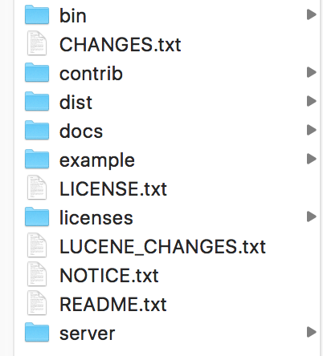
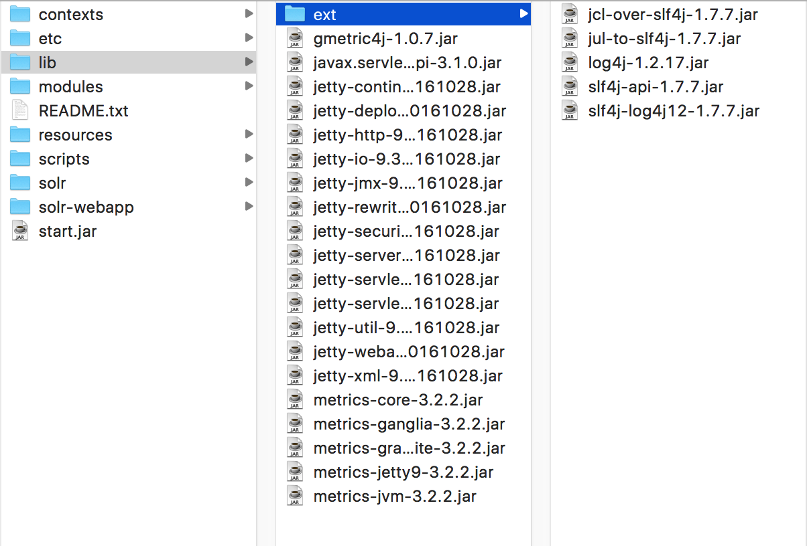
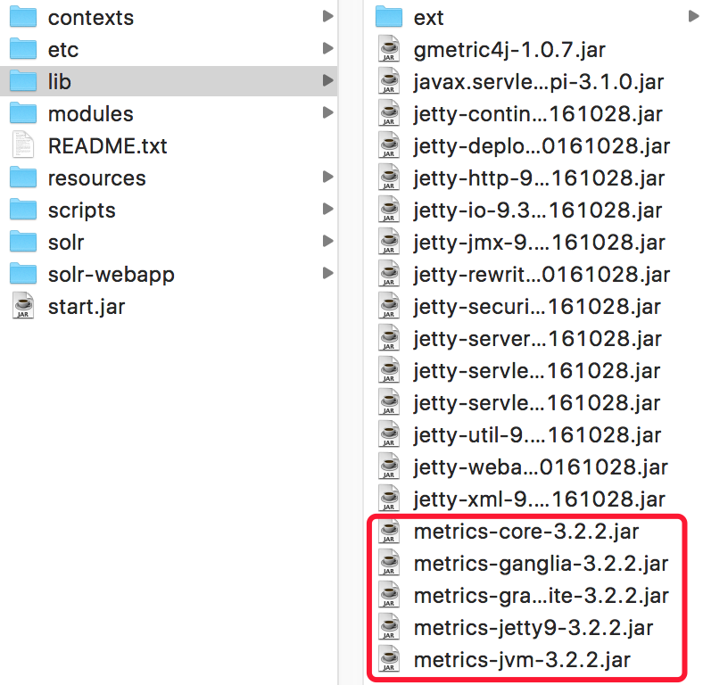
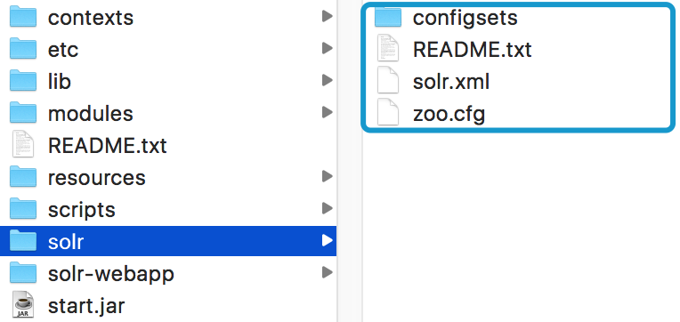
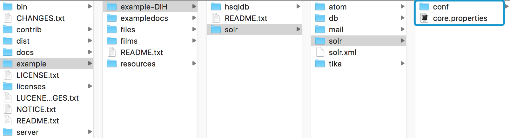
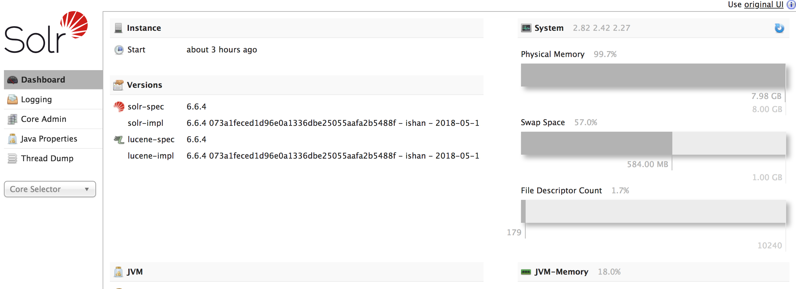
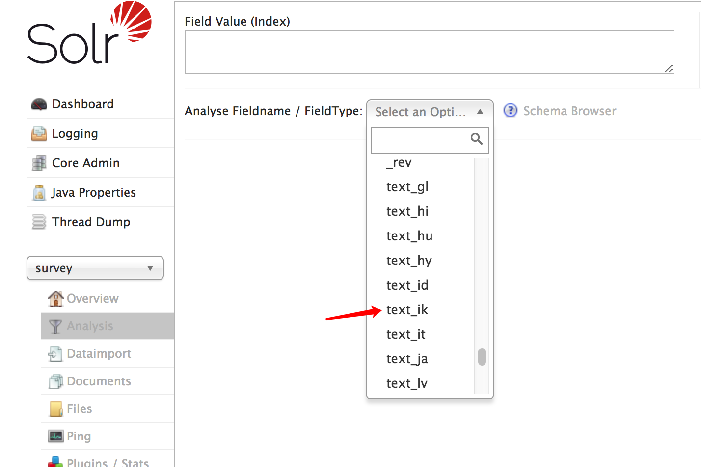
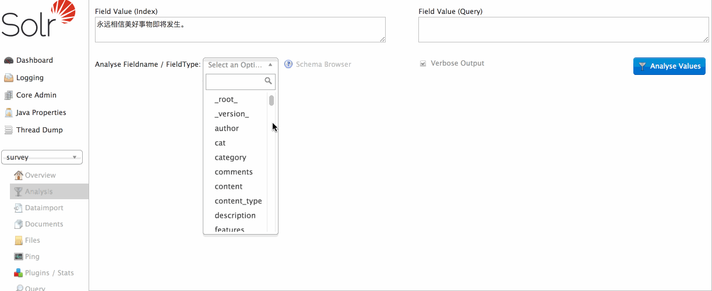

## Solr
> 为什么要引入Solr，它到底有什么优势。假想有这样一种情况，当我们在oracle去查询一些东西，无非是使用like或者join(当查询条件多，涉及的多表的话)这几种操作。当数据量大的时候，很难相信在大型数据库上去执行高速的查询，有以下两点原因：一是，数据库本身在性能上缺乏亮点，所以我们总提性能。二是，松散的文本，查询的话基本都是基于like，而join和like是数据库的性能杀手，与最求高效快速的理念相违背。所以我们需要一种和sql完全不同的数据检索方式，由此引出了solr。Solr是一个高性能，采用Java5开发，基于Lucene的全文搜索服务器。同时对其进行了扩展，提供了比Lucene更为丰富的查询语言，同时实现了可配置、可扩展并对查询性能进行了优化，并且提供了一个完善的功能管理界面，是一款非常优秀的全文搜索引擎。

## 搭建环境

- JDK：jdk1.8.0

- 开发环境：idea 2016.3

- 运行环境：apache-tomcat-8.0.32

- Solr：solr-6.6.4

- OS: Mac OS

## 搭建Solr

1. 下载Solr

	[solr](http://www-eu.apache.org/dist/lucene/solr/6.6.4/)下载地址

2. 解压

    

    `bin`：Solr的脚本启动工具目录。

	`contrib`：放关于solr的扩展。

	`dist`：在这里能找到Solr的核心JAR包和扩展JAR包。当我们试图把Solr嵌入到某个应用程序的时候会用到核心JAR包。

	`dist/solrj-lib`：包含构建基于Solr的客户端时会用到的JAR包。

	`dist/test-framework`：包含测试Solr时候会用到的JAR包。

	`docs`：该文件夹里面存放的是Solr文档，离线的静态HTML文件，还有API的描述。

	`example`：包含Solr的简单示例。

	`licenses`：各种许可和协。

	`server`：在本地把Solr作为服务运行的必要文件都存放在这里。

3. 将solr部署到tomcat容器中

- 将solr-6.6.4/server/solr-webapp下的webapp复制到tomcat的webapps目录下，并改名为solr（名字可以改成其他）
- 将solr-6.6.4/server/lib/ext的jar包复制到apache-tomcat-8.0.32/webapps/solr/WEB-INF/lib目录下

	

- 将solr-6.6.4/dist/下的`solr-dataimporthandler-6.6.0.jar`和`solr-dataimporthandler-extras-6.6.0.jar`复制到`apache-tomcat-8.0.32/webapps/solr/WEB-INF/lib`目录下

- 将solr-6.6.4/server/lib/下的以metrics开头的5个jar包复制到apache-tomcat-8.0.32\webapps\solr\WEB-INF\lib目录下，这三步的目标路径都是一样的。

	

- 接下来创建存放core的目录，在自己的用户目录下创建 solr-home，并将solr-6.6.4/server/solr/目录下的所有文件拷贝到自己创建的solr-home中

	

- 在solr-home下创建一个`survey`其实就是一个类似于数据库

- 将solr-6.6.4/example/exmaple-DIH/solr/solr/下的所有文件拷贝到创建的`survey`中，并编辑core.properties文件，添加name=survey

	

- 在tomcat下的solr里的配置文件来指定我创建的存储core的目录


	打开apache-tomcat-8.0.32/webapps/solr/WEB-INF下的web.xml，放入core目录的配置，大概在40行，解开注释

	
	```
	 <env-entry>
       <env-entry-name>solr/home</env-entry-name>
       <env-entry-value>/Users/weiTeng/javaEE/solr-home</env-entry-value>
       <env-entry-type>java.lang.String</env-entry-type>
    </env-entry>
	
	```	

	并定位到大概160行的位置注释掉权限配置

	```
	<!-- Get rid of error message -->
	<!--
	  <security-constraint>
	    <web-resource-collection>
	      <web-resource-name>Disable TRACE</web-resource-name>
	      <url-pattern>/</url-pattern>
	      <http-method>TRACE</http-method>
	    </web-resource-collection>
	    <auth-constraint/>
	  </security-constraint>
	  <security-constraint>
	    <web-resource-collection>
	      <web-resource-name>Enable everything but TRACE</web-resource-name>
	      <url-pattern>/</url-pattern>
	      <http-method-omission>TRACE</http-method-omission>
	    </web-resource-collection>
	  </security-constraint>
	-->
	```

- 在apache-tomcat-8.0.32/webapps/solr/WEB-INF目录下创建classes文件夹，并将solr-6.6.4/server/resources下的log4j.properties复制过去	

	log4j.properties

	```
	# Default Solr log4j config
	# rootLogger log level may be programmatically overridden by -Dsolr.log.level
	solr.log=/Users/weiTeng/javaEE/solr-log
	log4j.rootLogger=INFO, file, CONSOLE

	# Console appender will be programmatically disabled when Solr is started with option -Dsolr.log.muteconsole
	log4j.appender.CONSOLE=org.apache.log4j.ConsoleAppender
	log4j.appender.CONSOLE.layout=org.apache.log4j.EnhancedPatternLayout
	log4j.appender.CONSOLE.layout.ConversionPattern=%d{yyyy-MM-dd HH:mm:ss.SSS} %-5p (%t) [%X{collection} %X{shard} %X{replica} %X{core}] %c{1.} %m%n

	#- size rotation with log cleanup.
	log4j.appender.file=org.apache.log4j.RollingFileAppender
	log4j.appender.file.MaxFileSize=4MB
	log4j.appender.file.MaxBackupIndex=9

	#- File to log to and log format
	log4j.appender.file.File=${solr.log}/solr.log
	log4j.appender.file.layout=org.apache.log4j.EnhancedPatternLayout
	log4j.appender.file.layout.ConversionPattern=%d{yyyy-MM-dd HH:mm:ss.SSS} %-5p (%t) [%X{collection} %X{shard} %X{replica} %X{core}] %c{1.} %m%n

	# Adjust logging levels that should differ from root logger
	log4j.logger.org.apache.zookeeper=WARN
	log4j.logger.org.apache.hadoop=WARN
	log4j.logger.org.eclipse.jetty=WARN
	log4j.logger.org.eclipse.jetty.server.Server=INFO
	log4j.logger.org.eclipse.jetty.server.ServerConnector=INFO

	# set to INFO to enable infostream log messages
	log4j.logger.org.apache.solr.update.LoggingInfoStream=OFF
	```

- 环境搭建完成，启动tomcat，访问localhost:8080/solr/index.html

	


## 配置中文分词器

1. 下载适配于solr6.0+的 [ik-analyzer-solr6](https://github.com/zxiaofan/ik-analyzer-solr6/releases)	

2. 准备词库配置文件

	- `ext_stopword.dic`: 停用词词库，每个词占据一行
	- `IKAnalyzer.cfg.xml`: ik-analyzer配置文件
	- `mydict.dic`: 扩展词典，同样每个词占据一行

	`IKAnalyzer.cfg.xml`

	```
	<?xml version="1.0" encoding="UTF-8"?>
	<!DOCTYPE properties SYSTEM "http://java.sun.com/dtd/properties.dtd">  
	<properties>  
		<comment>IK Analyzer 扩展配置</comment>
		<!--用户可以在这里配置自己的扩展字典--> 
		<entry key="ext_dict">mydict.dic;</entry> 
		 
		<!--用户可以在这里配置自己的扩展停止词字典-->
		<entry key="ext_stopwords">ext_stopword.dic</entry> 
	</properties>

	```

3. 在solr-home/survey/conf/下的managed-schema文件中添加中文分词器配置

	```
	<fieldType name="text_ik" class="solr.TextField">
      <analyzer class="org.wltea.analyzer.lucene.IKAnalyzer"/>
  	</fieldType>
	```

4. 将`ext_stopword.dic`、`IKAnalyzer.cfg.xml`和`mydict.dic`放置到apache-tomcat-8.0.32/webapps/solr/WEB-INF/classes/下，并将`ikanalyzer-6.6.1.jar`放到WEB-INF/lib下

5. 重启solr

	

	对中文分词

		
	